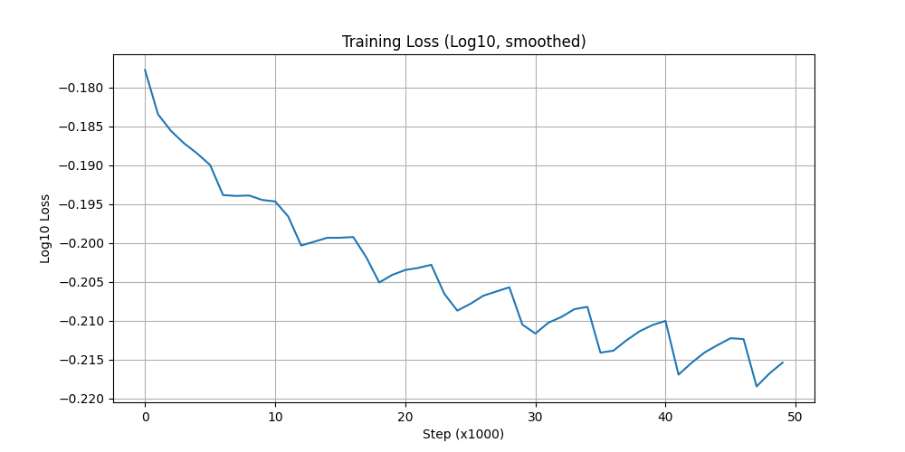

# Word2Vec Skip-gram Implementation

A PyTorch implementation of the Skip-gram model from the paper ["Efficient Estimation of Word Representations in Vector Space"](https://arxiv.org/abs/1301.3781) by Mikolov et al. (2013), featuring both **Hierarchical Softmax** and **Full Softmax** variants.

## 📋 Overview

This repository implements the Skip-gram architecture for learning distributed word representations (word embeddings). Given a center word, the model predicts its surrounding context words, learning meaningful vector representations in the process.

### Key Features

- ✅ **Two Training Strategies**:
  - **Hierarchical Softmax**: Uses a Huffman tree for efficient O(log V) training
  - **Full Softmax**: Naive implementation with O(V) complexity
- ✅ **Text8 Dataset**: Trained on the classic text8 corpus (100M characters)
- ✅ **Word Similarity & Analogy Tasks**: Built-in evaluation functions
- ✅ **Training Visualizations**: Loss curves and training progress plots

## 🏗️ Architecture

### Skip-gram Model

The Skip-gram model learns word embeddings by predicting context words given a center word:

```
Input: Center word → Embedding → Predict surrounding words
```

**Two embedding matrices**:
- `W_in`: Input embeddings (vocab_size × embedding_dim)
- `W_out`: Output embeddings (context predictions)

### Hierarchical Softmax vs Full Softmax

| Feature | Hierarchical Softmax | Full Softmax |
|---------|---------------------|--------------|
| **Time Complexity** | O(log V) | O(V) |
| **Training Speed** | Faster | Slower |
| **Memory** | Lower | Higher |
| **Implementation** | Huffman tree | Direct softmax |

## 📁 Project Structure

```
.
├── HS_SkipGram.py           # Hierarchical Softmax implementation
├── NaiveSkipGram.py         # Full Softmax implementation
├── skipgram_hs.pth          # Trained HS model weights
├── naive_skipgram_model.pth # Trained full softmax weights
├── loss.png                 # Training loss visualization
├── text8                    # Training corpus (download separately)
├── requirements.txt         # Python dependencies
└── README.md               # This file
```

## 🚀 Getting Started

### Prerequisites

```bash
pip install -r requirements.txt
```

**Required packages**:
- PyTorch >= 1.9.0
- matplotlib
- numpy

### Download Dataset

Download the text8 corpus:

```bash
wget http://mattmahoney.net/dc/text8.zip
unzip text8.zip
```

The text8 dataset contains the first 100M characters from Wikipedia (cleaned).

### Training

#### Hierarchical Softmax (Recommended)

```bash
python HS_SkipGram.py
```

**Hyperparameters**:
- Embedding dimension: 300
- Window size: 5
- Min word frequency: 5
- Batch size: 1024
- Training steps: 50,000
- Learning rate: 1e-3

#### Full Softmax

```bash
python NaiveSkipGram.py
```

**Hyperparameters**:
- Embedding dimension: 300
- Window size: 5
- Min word frequency: 5
- Batch size: 1024
- Training steps: 100,000
- Learning rate: 1e-3

## 📊 Results

### Word Similarity Examples

```python
get_similar('king')
# Output:
# 1. queen         (0.782)
# 2. prince        (0.751)
# 3. monarch       (0.698)
# ...

get_similar('france')
# Output:
# 1. germany       (0.845)
# 2. italy         (0.821)
# 3. spain         (0.809)
# ...
```

### Word Analogy Examples

The model can solve analogies like "king - man + woman = queen":

```python
analogy('king', 'man', 'woman')
# Result: queen (0.823)

analogy('paris', 'france', 'rome')
# Result: italy (0.791)

analogy('walk', 'walking', 'swim')
# Result: swimming (0.806)
```

## 🔧 Implementation Details

### Hierarchical Softmax

The Hierarchical Softmax implementation uses a **Huffman tree** to reduce computational complexity:

1. **Huffman Tree Construction**: Builds a binary tree where frequent words have shorter paths
2. **Path Encoding**: Each word has a unique path from root to leaf
3. **Binary Classification**: At each node, predict left (0) or right (1)
4. **Loss Calculation**: Negative log-likelihood of the correct path

**Advantages**:
- Faster training (O(log V) vs O(V))
- Better for large vocabularies
- More memory efficient

### Dataset Generation

For each token in the corpus:
1. Select a random window size (1 to `window_size`)
2. Extract context words within the window
3. Create (center, context) training pairs
4. Apply subsampling for frequent words (optional)

## 📈 Training Curves



The loss curve shows log10 of the cross-entropy loss, smoothed over 1000-step windows.

## 🧪 Evaluation

The repository includes two evaluation functions:

### 1. Word Similarity

```python
get_most_similar(word, k=8)
```

Finds the k most similar words using cosine similarity.

### 2. Word Analogies

```python
get_analogy(a, b, c, k=1)
```

Solves analogies of the form: `a - b + c = ?`

## 💡 Key Hyperparameters

| Parameter | Value | Description |
|-----------|-------|-------------|
| `n_embd` | 300 | Embedding dimension |
| `window_size` | 5 | Context window size |
| `min_freq` | 5 | Minimum word frequency |
| `batch_size` | 1024 | Training batch size |
| `learning_rate` | 1e-3 | AdamW learning rate |
| `max_tokens` | 1M | Corpus size limit |

## 📚 References

### Original Papers

1. **Mikolov et al. (2013)**: [Efficient Estimation of Word Representations in Vector Space](https://arxiv.org/abs/1301.3781)
   - Introduced the Skip-gram and CBOW architectures

2. **Mikolov et al. (2013)**: [Distributed Representations of Words and Phrases and their Compositionality](https://arxiv.org/abs/1310.4546)
   - Introduced negative sampling and subsampling

3. **Morin & Bengio (2005)**: [Hierarchical Probabilistic Neural Network Language Model](https://www.iro.umontreal.ca/~lisa/pointeurs/hierarchical-nnlm-aistats05.pdf)
   - Introduced hierarchical softmax for language modeling

### Additional Resources

- [Word2Vec Tutorial](http://mccormickml.com/2016/04/19/word2vec-tutorial-the-skip-gram-model/)
- [Original C Implementation](https://code.google.com/archive/p/word2vec/)

## 🤝 Contributing

Contributions are welcome! Possible improvements:

- [ ] Implement negative sampling
- [ ] Add subsampling for frequent words
- [ ] Support for phrase detection
- [ ] Tensorboard logging
- [ ] Pre-trained model zoo
- [ ] Multi-GPU training

## ✨ Acknowledgments

- Original Word2Vec implementation by Tomas Mikolov at Google
- text8 dataset from Matt Mahoney
- PyTorch team for the excellent deep learning framework

## 📧 Contact

For questions or suggestions, please open an issue on GitHub.

---

**Note**: This is an educational implementation. For production use, consider using pre-trained embeddings from [GloVe](https://nlp.stanford.edu/projects/glove/), [FastText](https://fasttext.cc/), or transformer-based models like BERT.